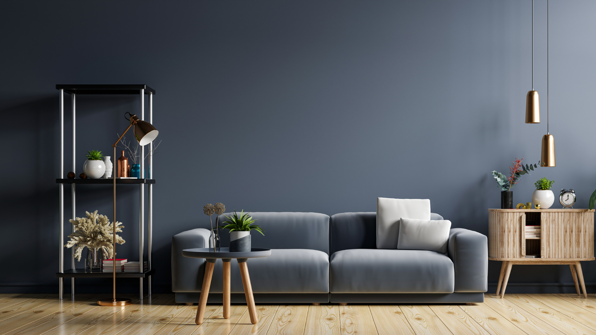

# CityScapes Landing Page
This is a free, fully responsive landing page that is easily customizable for a non web user. From the html, images can be readily changed. If you wish to tinker around with more things you can also change the variables in the SASS folder under 1-base folder, in the file named _variables.scss

Demo available in codepen: https://codepen.io/J_Enrique/pen/ypgvLN

a

a

a

a

a

a

a

a

a

a

a

<!DOCTYPE html>
<html>
     <head>
          <!-- Required meta tags -->
          <meta charset="utf-8">
          <meta http-equiv="X-UA-Compatible" content="IE=edge">
          <meta name="viewport" content="width=device-width, initial-scale=1, shrink-to-fit=no">

          <!-- Title tag -->
          <title>One Page Responsive CityScapes Template</title>

          <!-- Font awesome -->
          <link href="https://maxcdn.bootstrapcdn.com/font-awesome/4.7.0/css/font-awesome.min.css" rel="stylesheet" integrity="sha384-wvfXpqpZZVQGK6TAh5PVlGOfQNHSoD2xbE+QkPxCAFlNEevoEH3Sl0sibVcOQVnN" crossorigin="anonymous">

          <!-- Animate.css -->
          <link rel="stylesheet" href="https://cdnjs.cloudflare.com/ajax/libs/animate.css/3.5.2/animate.min.css">

          <!-- Normalize -->
          <link rel="stylesheet" href="https://cdnjs.cloudflare.com/ajax/libs/normalize/7.0.0/normalize.css">

          <!-- Custom CSS -->
          <link href="css/styles.css" rel="stylesheet">

          
     </head>
     <body>
          <!-- Main Navigation -->
          <nav class="main-nav" id="main-nav">
               

                    
                    

                         

                         

                         

                    

                    <ul class="nav-links">
                         <li><a href="#about">About</a></li>
                         <li><a href="#reserve">Reservations</a></li>
                         <li><a href="#contact">Contact</a></li>
                    </ul>
               

          </nav>

          <!-- Main header -->
          <header>
               <!-- First replaceble image -->
               
               

                    

                         
                         <h1><strong>Gaisa</strong>Kondicionieri</h1>
                         <h2>Gaiss-Gaiss siltumsūkņi jūsu komfortam</h2>
                    

               

          </header>

          <!-- Main content -->

          <main>
               

                    <!-- second replaceble image -->
                    <!--  -->
                    
                    
                    <!-- THIS IS WHERE I NEED YOUR HELP -->
                    
                    

                         

                              

                              
AAAA
       
                         

                    

                    <!-- THIS IS WHERE IT ENDS -->

               

               

               

               

                    <h2 class="section-title"></h2>
                    
CityScapes is great for any travel agency or tour agency, that wishes to showcase the focal points of a city. If you want a unique looking landing page that has a unique artistic style that will attract clients, then this is the template for you. Go ahead and download it for free from Github.

                    <a href="#" class="btn btn-outline-purple">Pieteikties</a>
               

               

                    <!-- Third replaceble image -->
                    

          <!-- Main footer -->
          <footer>
               

                    <!-- Easily replaceble copyright information -->
                    <small>Your copyright 2017.</small>

                    <!-- Make sure to edit the links so that they go to your social media. -->
                    

                         <ul>
                              <li><a href="#"><i class="fa fa-facebook" aria-hidden="true"></i></a></li>
                              <li><a href="#"><i class="fa fa-twitter" aria-hidden="true"></i></a></li>
                              <li><a href="#"><i class="fa fa-snapchat-square" aria-hidden="true"></i></a></li>
                              <li><a href="#"><i class="fa fa-instagram" aria-hidden="true"></i></a></li>
                         </ul>
                    

               

          </footer>

          <!-- Scripts placed at the bottom for faster loading -->
          
          

          <!-- Optional js files -->
          <!-- Quick note: if you remove astonish, make sure you remove the embedded styles in the top -->
          
          
          
     </body>
</html>
